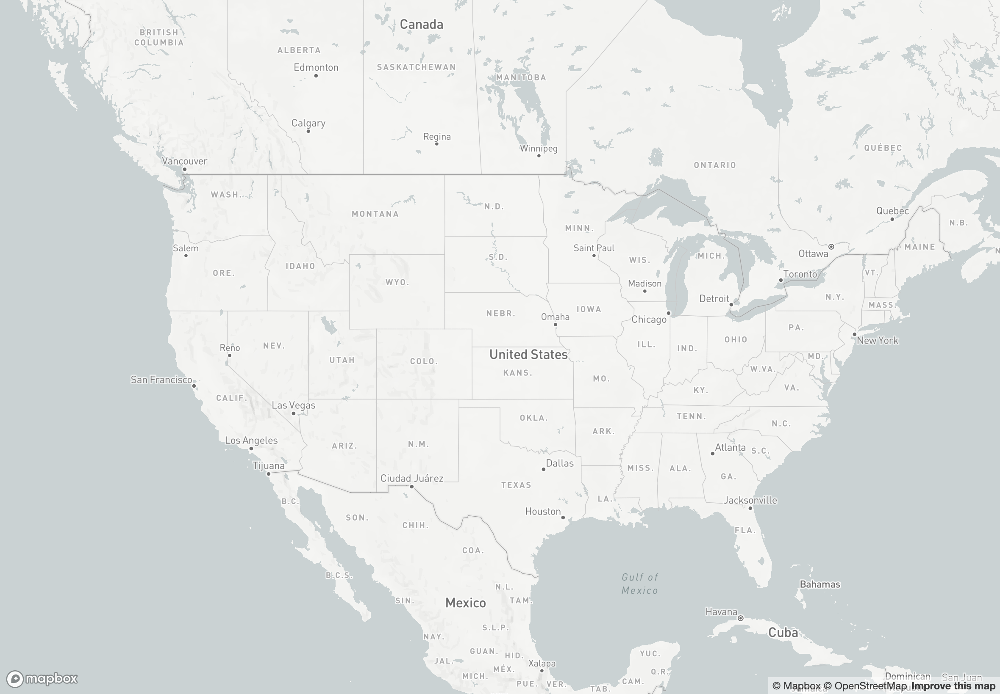
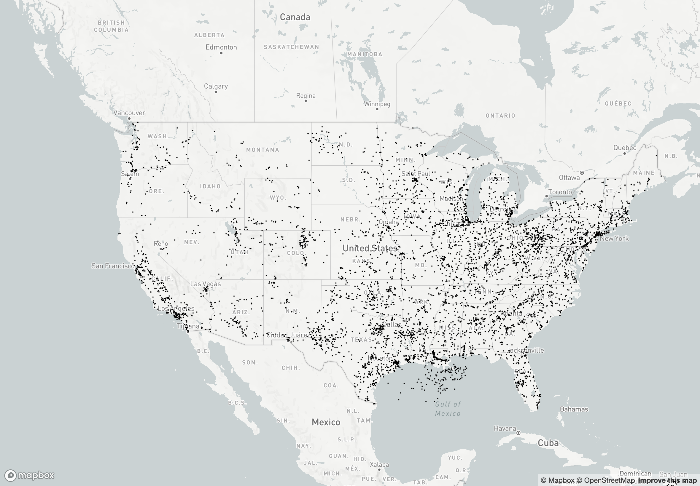
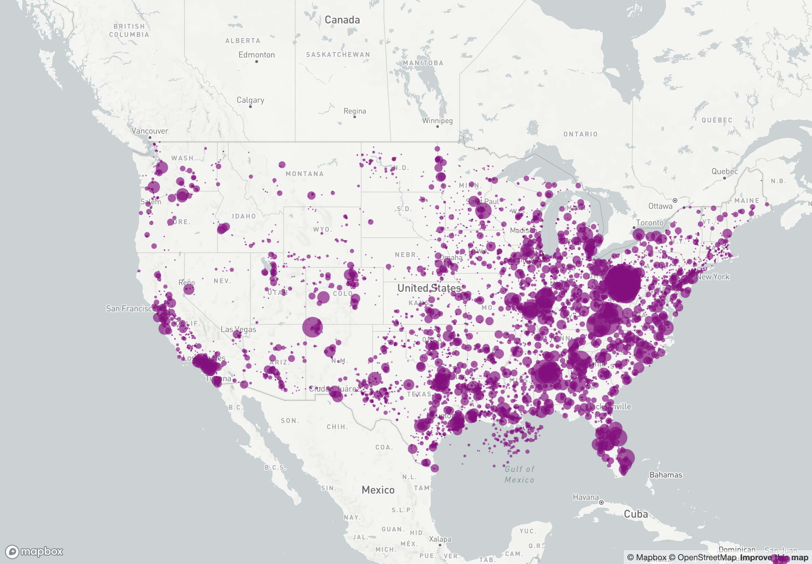
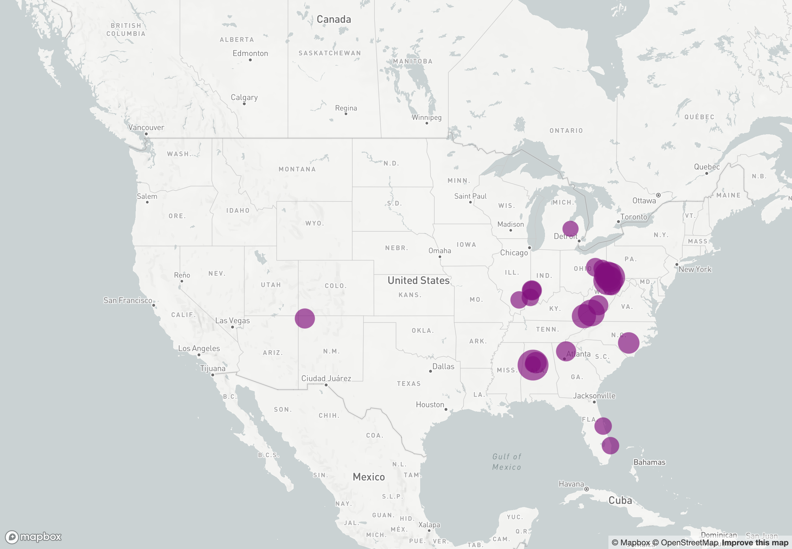
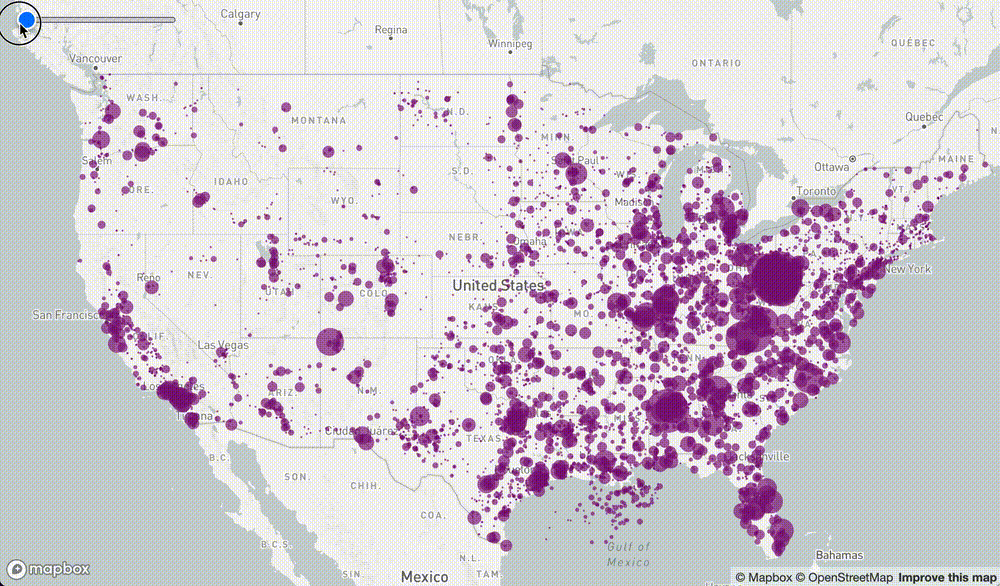

# deck.gl @ All Things Open 2022

Repo for [Visualizing Large Greenhouse Gas Datasets in the Browser With deck.gl](https://2022.allthingsopen.org/sessions/2-for-1-visualizing-large-greenhouse-gas-datasets-in-the-browser-with-deck-gl-tba/)

## Installation

1. Install [Node.js](https://nodejs.org), which comes with [npm](https://www.npmjs.com/).
1. \$ `git clone git@github.com:davidcalhoun/deckgl-all-things-open-2022.git && cd deckgl-all-things-open-2022`
1. \$ `npm install`
1. Create an account at [mapbox.com](https://www.mapbox.com/)
1. Copy your "Default public token" from https://account.mapbox.com/access-tokens/
1. Create a new file named `.env.local` in the root directory. This file is in `.gitignore` and shouldn't be checked into Github.
1. Open `.env.local` and add this line (be sure to paste your token): `MAPBOX_ACCESS_TOKEN=PASTE_YOUR_TOKEN_HERE`
1. Edit `src/index.js` with the Step you want to run (Step 1 by default).
1. \$ `npm start`

## Step by step previews

### Step 1

### Step 2

### Step 3

### Step 4

### Step 5

### Step 6
